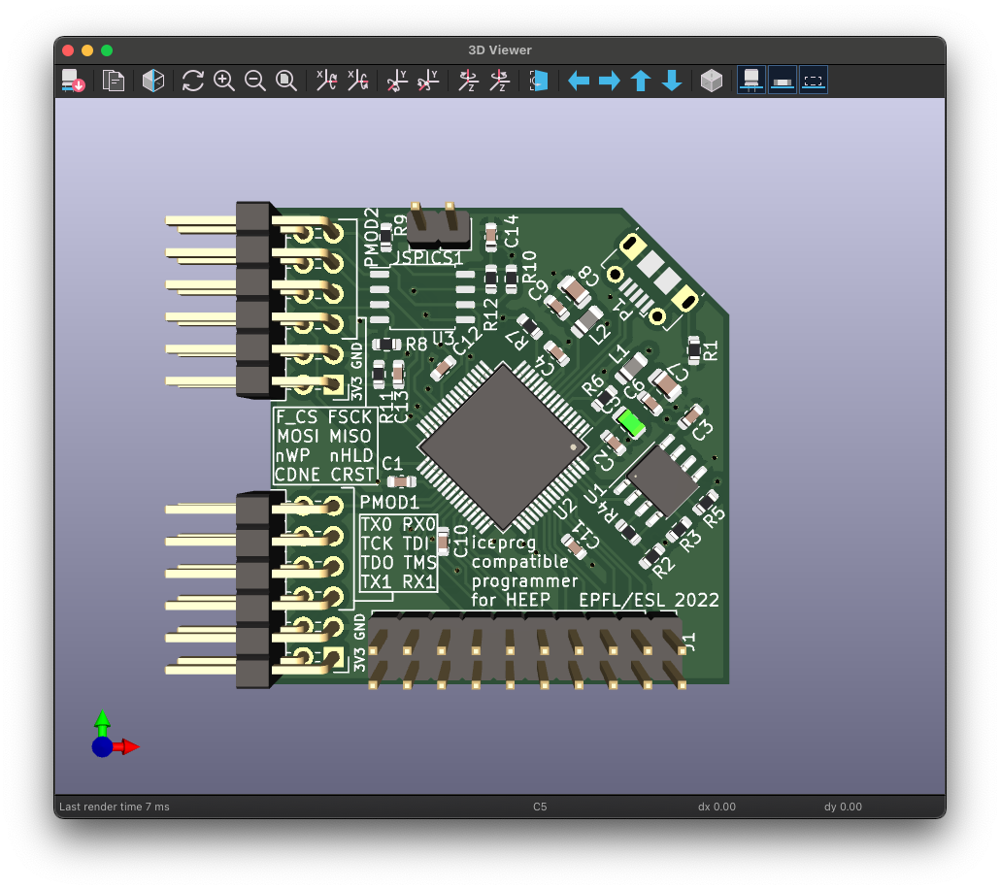

# This repository contains the HEEP programmer PMOD
This PMOD pcb provides the following features:

1) An OpenOCD compatible JTAG programmer for debugging the RISC-V core
2) An 128 MBIT (Q)SPI flash chip as well as an [iceprog](https://github.com/YosysHQ/icestorm/tree/master/iceprog) compatible programmer for the flash (the programmer has been deived from [the excellent icebreaker board](https://github.com/icebreaker-fpga/icebreaker))
3) Two UARTs 

